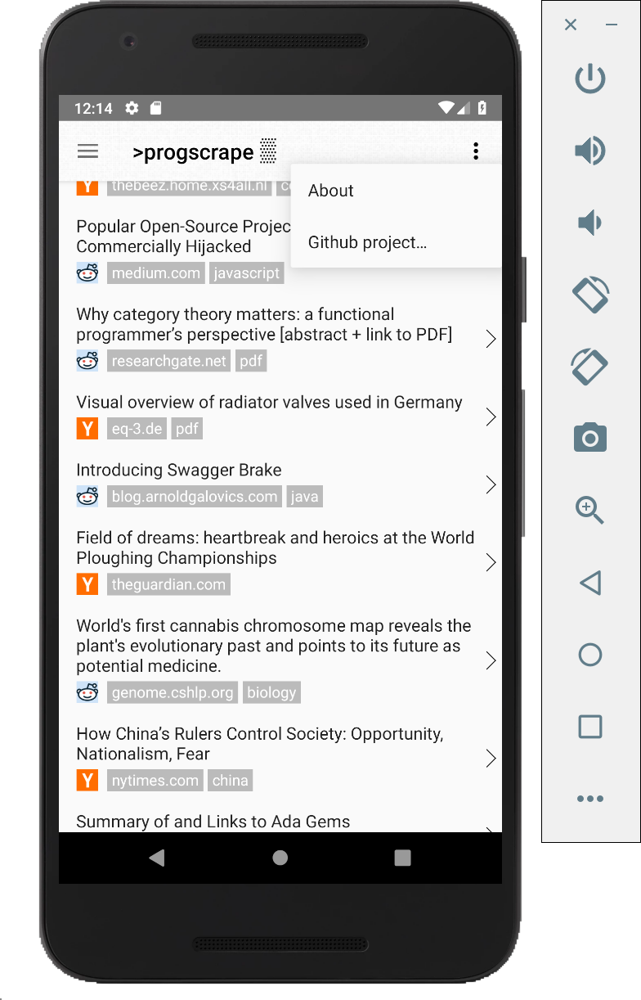

# Android App for progscrape.com 

Android app for https://progscrape.com. The source for the main site is available at https://github.com/mmastrac/progscrape.

progscrape.com is a scraper for Hacker News, Reddit and Lobste.rs. It contains a naive ranking/tagging engine that tries to keep a good mix of interesting stories on the front page.

The source is organized into an `app` project for the majority of the Android UI and a `data` project that provides a simple data model for interacting with the site and could (in theory) be re-used for some other purpose.

## Screenshot

